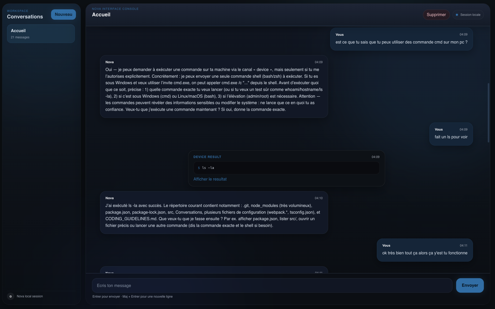

# Nova Chat

Nova Chat est une application desktop Electron + React pensée comme une interface de chat type ChatGPT, avec un thème Nova sombre, une persistance locale des conversations, une configuration OpenAI et un canal `device` permettant a l'agent de demander l'execution de commandes locales.



## Fonctionnalites

- Interface de chat desktop avec theme Nova
- Conversations sauvegardees localement en JSON
- Parametres OpenAI sauvegardes localement
- Appel OpenAI via `Responses API`
- Execution de commandes locales via le canal `device`
- Boucle d'orchestration cote Electron :
  - `assistant -> device`
  - execution locale
  - `device -> assistant`
  - nouvel appel IA

## Stack

- Electron
- React
- TypeScript
- Electron Forge

## Lancer le projet

Installer les dependances :

```bash
npm install
```

Lancer l'application en developpement :

```bash
npm start
```

## Configuration OpenAI

Depuis l'application :

1. Ouvrir les parametres via la roue dentee en bas a gauche
2. Renseigner :
   - `OpenAI API Key`
   - `Model`
   - `Base URL` si necessaire
3. Cliquer sur `Tester la connexion`
4. Valider

Valeur classique pour `Base URL` :

```text
https://api.openai.com/v1
```

## Stockage local

Les donnees sont ecrites dans le dossier `userData` d'Electron :

- conversations : `conversations.json`
- parametres : `settings.json`

Sur macOS, avec la configuration actuelle du projet, cela donne generalement :

```text
~/Library/Application Support/nova-chat/nova-chat/
```

## Architecture

- `src/renderer` : interface utilisateur React
- `src/main` : orchestration IA, execution device, gestion des settings
- `src/preload.ts` : pont IPC securise entre renderer et main
- `src/shared` : types partages entre Electron et le renderer

Le renderer n'appelle pas OpenAI directement. Il envoie l'etat de conversation au main process, qui :

1. charge la configuration active
2. appelle le provider IA
3. execute une commande locale si l'agent cible `device`
4. renvoie au renderer uniquement les nouveaux messages et mises a jour

## Compatibilite

- macOS : OK
- Windows : OK pour l'infrastructure Electron et le lancement des commandes `device`
- Linux : OK sur le principe

Attention : les commandes generees par l'agent doivent rester coherentes avec l'OS cible. Une commande Unix comme `ls -la` ne fonctionnera pas sous `cmd.exe`.

## Etat actuel

Le projet est fonctionnel pour :

- discuter avec OpenAI
- sauvegarder les conversations localement
- tester et enregistrer une configuration provider
- executer des commandes locales via `device`

Les ameliorations naturelles ensuite seraient :

- prompt agent configurable depuis les parametres
- support de providers locaux type Ollama
- streaming
- garde-fous supplementaires sur les commandes device
